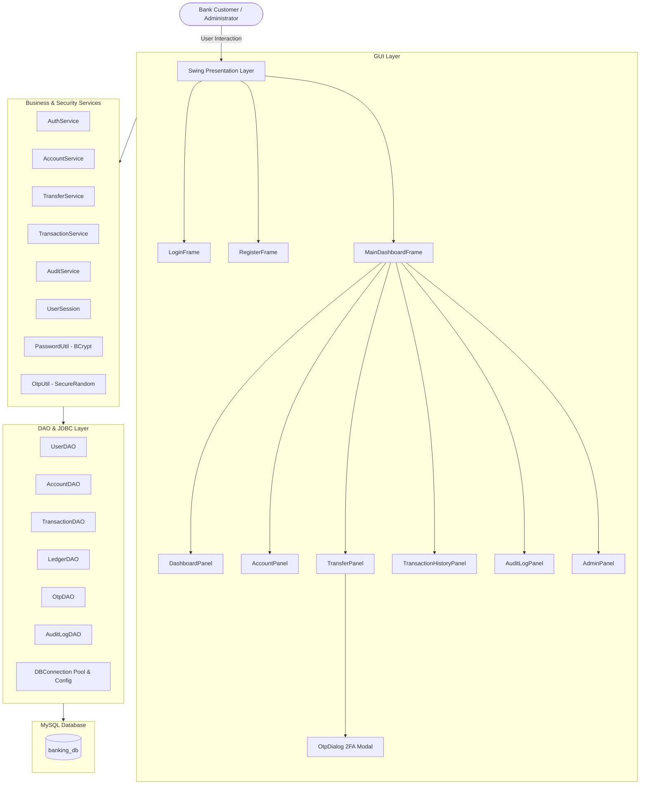
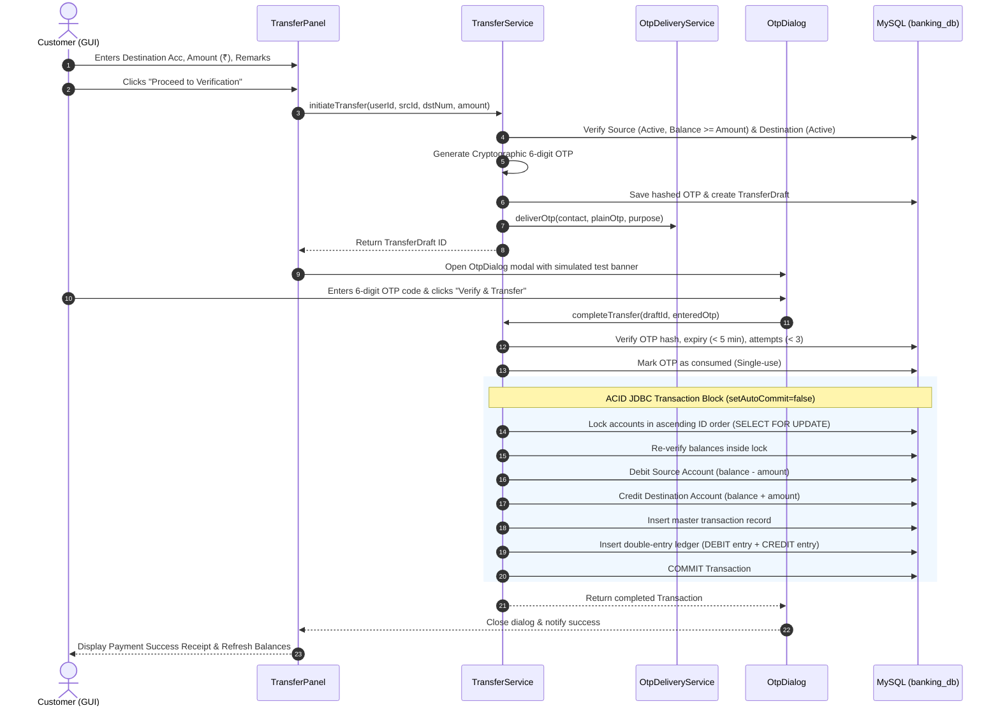
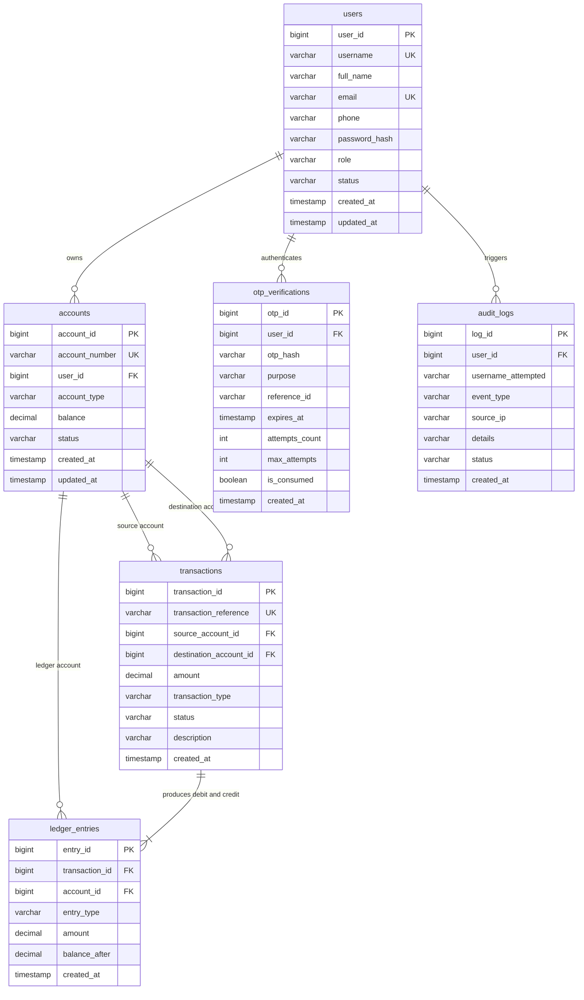

# Banking Application with Security Features

A desktop-based **Banking Application** built with **Core Java**, **Java Swing**, **JDBC**, **MySQL**, and **Maven**. Developed as an Information Technology Internship Major Project featuring **BCrypt Password Hashing**, **Two-Factor Authentication (OTP)**, **Pessimistic Locking for Atomic Concurrency**, **Double-Entry Accounting Ledger**, and **Security Audit Logging**.

---

## 1. Project Overview

The **Banking Application with Security Features** provides a secure, ACID-compliant banking simulation designed to eliminate common financial vulnerabilities such as race conditions, double-spending, data tampering, and credential harvesting.

Key highlights:
- **Layered Enterprise Architecture:** Clean separation of concerns across Model, DAO, Service, Security, Utility, and GUI packages.
- **Pessimistic Concurrency & Deadlock Prevention:** Strict account lock ordering (`Math.min` / `Math.max` ID locking with `SELECT ... FOR UPDATE`) prevents deadlocks and overdrafts under simultaneous multi-threaded transfers.
- **Two-Factor Authentication (OTP):** Cryptographically secure, single-use, 5-minute time-bound OTPs verified before any fund transfer commits.
- **Double-Entry Accounting Ledger:** Every transfer writes balanced `DEBIT` and `CREDIT` entries into an immutable ledger table (`ledger_entries`) alongside the master transaction.
- **Security Audit Trail:** Comprehensive event logging (`audit_logs`) tracking login attempts, OTP issuances, transfer outcomes, and account status transitions.

> [!IMPORTANT]
> **Educational Simulation Notice:** This application is developed strictly as an educational banking simulation. It must not be connected to live bank accounts, real clearing systems, or used to process actual monetary funds.

---

## 2. System Architecture

The application adopts a classic 3-Tier Layered Architecture:



### Layer Responsibilities

| Layer | Primary Classes | Responsibilities |
| :--- | :--- | :--- |
| **GUI Layer** | `MainDashboardFrame`, `LoginFrame`, `RegisterFrame`, `OtpDialog`, `DashboardPanel`, `TransferPanel`, `AccountPanel`, `TransactionHistoryPanel`, `AuditLogPanel`, `AdminPanel` | Renders high-contrast, modern banking Swing UI; executes DB operations asynchronously via `SwingWorker`; enforces client validation and prevents double clicks. |
| **Security Layer** | `PasswordUtil`, `OtpUtil`, `UserSession`, `SimulatedOtpDeliveryService` | Computes BCrypt salts and password hashes; generates cryptographic 6-digit OTPs; manages active session state; isolates OTP dispatch channels. |
| **Service Layer** | `AuthService`, `AccountService`, `TransferService`, `TransactionService`, `AuditService` | Coordinates multi-step operations; performs authorization checks; coordinates atomic 2-phase fund transfers; writes audit records. |
| **DAO Layer** | `UserDAO`, `AccountDAO`, `TransactionDAO`, `LedgerDAO`, `OtpDAO`, `AuditLogDAO` | Executes parameterized SQL statements via JDBC prepared statements; manages transaction demarcation (`commit`/`rollback`); executes row-level locking (`FOR UPDATE`). |
| **Model Layer** | `User`, `Account`, `Transaction`, `LedgerEntry`, `OtpRecord`, `AuditLog`, `TransferDraft` | Strongly typed domain POJOs with `BigDecimal` monetary values and domain enums. |
| **Utility Layer** | `DBConnection`, `ValidationException`, `BankingException` | Hierarchical database configuration (environment variables, classpath properties, system properties); custom banking exceptions. |

---

## 3. Atomic Fund Transfer Sequence (with 2FA OTP)



---

## 4. Database Schema & Entity Relationships



---

## 5. Technology Stack

- **Core Platform:** Java 21 / 25 (`java.base`, `java.desktop`, `java.sql`)
- **Desktop GUI:** Java Swing (`javax.swing`, `java.awt`)
- **Database Engine:** MySQL Server 8.0+
- **JDBC Driver:** MySQL Connector/J (`com.mysql:mysql-connector-j:9.5.0`)
- **Cryptographic Hashing:** jBCrypt (`org.mindrot:jbcrypt:0.4`)
- **Build & Dependency Management:** Apache Maven 3.9+
- **Automated Testing:** JUnit 5 Jupiter (`org.junit.jupiter:junit-jupiter:5.10.2`)
- **In-Memory Testing DB:** H2 Database (`com.h2database:h2:2.3.232`) for standalone CI test execution

---

## 6. Directory Structure

```text
major-project/banking-application/
├── pom.xml                                   # Maven project dependencies and build plugins
├── README.md                                 # Complete documentation, architecture, and diagrams
├── schema.sql                                # Production/Dev MySQL database schema with seed data
├── .gitignore                                # Git ignore file
├── db.properties.example                     # Example environment credentials configuration
├── src/
│   ├── main/
│   │   ├── java/
│   │   │   └── com/banking/
│   │   │       ├── Main.java                 # Entry point and Look & Feel initialization
│   │   │       ├── model/                    # Domain POJOs and Enums
│   │   │       │   ├── User.java
│   │   │       │   ├── UserRole.java
│   │   │       │   ├── UserStatus.java
│   │   │       │   ├── Account.java
│   │   │       │   ├── AccountType.java
│   │   │       │   ├── AccountStatus.java
│   │   │       │   ├── Transaction.java
│   │   │       │   ├── TransactionType.java
│   │   │       │   ├── TransactionStatus.java
│   │   │       │   ├── LedgerEntry.java
│   │   │       │   ├── EntryType.java
│   │   │       │   ├── OtpRecord.java
│   │   │       │   ├── TransferDraft.java
│   │   │       │   ├── AuditLog.java
│   │   │       │   └── AuditEventType.java
│   │   │       ├── dao/                      # Data Access Objects (JDBC & Prepared Statements)
│   │   │       │   ├── UserDAO.java
│   │   │       │   ├── AccountDAO.java
│   │   │       │   ├── TransactionDAO.java
│   │   │       │   ├── LedgerDAO.java
│   │   │       │   ├── OtpDAO.java
│   │   │       │   └── AuditLogDAO.java
│   │   │       ├── service/                  # Business Logic Layer
│   │   │       │   ├── AuthService.java
│   │   │       │   ├── AccountService.java
│   │   │       │   ├── TransferService.java
│   │   │       │   ├── TransactionService.java
│   │   │       │   └── AuditService.java
│   │   │       ├── security/                 # Cryptography & Session Management
│   │   │       │   ├── PasswordUtil.java     # BCrypt hashing (log rounds = 12)
│   │   │       │   ├── OtpUtil.java          # Cryptographic SecureRandom 6-digit OTP
│   │   │       │   ├── OtpDeliveryService.java # Pluggable delivery interface
│   │   │       │   ├── SimulatedOtpDeliveryService.java # Academic dev delivery channel
│   │   │       │   └── UserSession.java      # Application thread-safe session holder
│   │   │       ├── util/                     # Utilities
│   │   │       │   ├── DBConnection.java     # Hierarchical connection configuration
│   │   │       │   ├── ValidationException.java
│   │   │       │   └── BankingException.java
│   │   │       └── gui/                      # Swing User Interface Screens
│   │   │           ├── BankingTheme.java     # Design system, colors, fonts, buttons
│   │   │           ├── LoginFrame.java       # User authentication window
│   │   │           ├── RegisterFrame.java    # Customer account opening registration
│   │   │           ├── OtpDialog.java        # 2FA modal verification dialog
│   │   │           ├── MainDashboardFrame.java # Master window with navigation
│   │   │           ├── DashboardPanel.java   # Financial metric overview
│   │   │           ├── AccountPanel.java     # Account management panel
│   │   │           ├── TransferPanel.java    # Fund transfer interface
│   │   │           ├── TransactionHistoryPanel.java # Filterable ledger & statements
│   │   │           ├── AuditLogPanel.java    # Security audit events viewer
│   │   │           └── AdminPanel.java       # System administrator control panel
│   │   └── resources/
│   │       └── db.properties                 # Default local MySQL configuration
│   └── test/
│       ├── java/
│       │   └── com/banking/
│       │       ├── security/
│       │       │   ├── PasswordUtilTest.java # BCrypt hashing unit tests
│       │       │   └── OtpUtilTest.java      # OTP generation & validation unit tests
│       │       └── service/
│       │           ├── AuthServiceValidationTest.java # Registration & login rule tests
│       │           ├── TransferServiceValidationTest.java # Amount & limit validation tests
│       │           └── BankingIntegrationTest.java # Comprehensive atomic transaction & concurrency tests
│       └── resources/
│           └── schema-test.sql               # In-memory H2 schema for unit & integration testing
```

---

## 7. Setup & Installation Instructions

### Prerequisites
1. **Java JDK 21 or later** installed and configured in `JAVA_HOME`.
2. **Apache Maven 3.9+** installed and available in `PATH`.
3. **MySQL Server 8.0+** running locally on port `3306`.

### Step 1: Database Setup
Connect to MySQL and execute `schema.sql`:

```bash
# Using MySQL Command Line Client
mysql -u root -p < schema.sql
```

This creates the database `banking_db` and pre-seeds it with demonstration users and active accounts.

### Step 2: Database Configuration
Verify or modify database credentials in `src/main/resources/db.properties` or set environment variables:

```properties
# db.properties
db.url=jdbc:mysql://localhost:3306/banking_db?useSSL=false&allowPublicKeyRetrieval=true&serverTimezone=UTC
db.user=root
db.password=root@123
```

Alternatively, supply environment variables without touching configuration files:
```bash
set DB_URL=jdbc:mysql://localhost:3306/banking_db
set DB_USER=root
set DB_PASSWORD=your_password
```

---

## 8. Build, Test, and Execution Commands

Run commands from the directory `major-project/banking-application/`:

### Run Automated Tests
```bash
mvn test
```
*Executes all 27 unit and integration tests (including atomic concurrency and rollback checks).*

### Build Package (JAR)
```bash
mvn clean package
```
*Generates executable artifact `target/banking-application-1.0.0.jar`.*

### Run Application
You can run the application directly using Maven:
```bash
mvn exec:java
```

Or execute the compiled classes directly:
```bash
java -cp "target/classes;target/dependency/*" com.banking.Main
```

---

## 9. Pre-configured Demonstration Accounts

| Role | Username | Email | Password | Initial Accounts & Balances |
| :--- | :--- | :--- | :--- | :--- |
| **Customer** | `avadhut` | `avadhut@example.com` | `Password@123` | **10010000101** (SAVINGS: ₹25,000.00)<br>**10010000102** (CHECKING: ₹12,500.00) |
| **Customer** | `john_doe` | `john@example.com` | `Password@123` | **10010000201** (SAVINGS: ₹45,000.00) |
| **Customer** | `jane_smith` | `jane@example.com` | `Password@123` | **10010000301** (SAVINGS: ₹30,000.00) |
| **Administrator** | `admin` | `admin@bank.com` | `AdminPass@123` | Has access to the **Administration** tab to freeze/unfreeze accounts and view system-wide logs. |

---

## 10. Key Security Features

1. **BCrypt Password Hashing with Salt:**
   - Passwords are never stored or logged in plain text.
   - Hashed using `org.mindrot:jbcrypt` with log work factor `12`.
2. **Pessimistic Lock Ordering & Concurrency Safety:**
   - Transfers lock accounts using `SELECT ... FOR UPDATE` in strict ascending ID order (`firstLock = min(srcId, dstId)`).
   - Eliminates database deadlocks during bi-directional simultaneous transfers.
   - Prevents overdrafts and double-spending across threads.
3. **Cryptographically Secure OTP:**
   - 6-digit numeric OTP generated using `java.security.SecureRandom`.
   - Expires in 5 minutes.
   - Maximum 3 incorrect attempts before automatic invalidation.
   - Single-use: instantly marked `consumed` upon verification.
   - Hashed in the database to prevent plain-text discovery.
4. **Isolated Development OTP Delivery Channel:**
   - Implements `SimulatedOtpDeliveryService` with clear, explicit notification banners.
   - Designed around the `OtpDeliveryService` interface for drop-in replacement with Twilio / AWS SNS / SendGrid in enterprise environments.
5. **Session Isolation & Authorization:**
   - `UserSession` enforces role-aware checks.
   - Users are prohibited from querying or debiting accounts belonging to other customers.
6. **SQL Injection Defense:**
   - 100% of SQL queries utilize parameterized `PreparedStatement`.
7. **Comprehensive Audit Trail:**
   - Tracks `LOGIN_SUCCESS`, `LOGIN_FAILURE`, `REGISTRATION`, `TRANSFER_INITIATED`, `OTP_GENERATED`, `OTP_VERIFIED`, `OTP_FAILED`, `TRANSFER_SUCCESS`, `TRANSFER_FAILED`, and `STATUS_CHANGE`.
   - Protects customer privacy by never logging passwords or plain OTPs.

---

## 11. Known Educational Limitations

- **Simulated OTP Dispatch:** For local demonstration purposes, OTPs are printed to the console and displayed in a designated development simulation banner in the dialog. In production, configure an enterprise SMS/Email gateway.
- **Single-Node Desktop Environment:** Designed as a desktop Swing application running in a local JVM rather than a distributed cloud microservice cluster.
- **Local Currency Precision:** Currency calculations use `java.math.BigDecimal` with scale 2 (`HALF_UP` rounding). Foreign currency multi-exchange rates are out of academic project scope.
